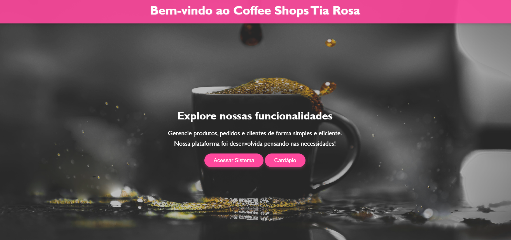
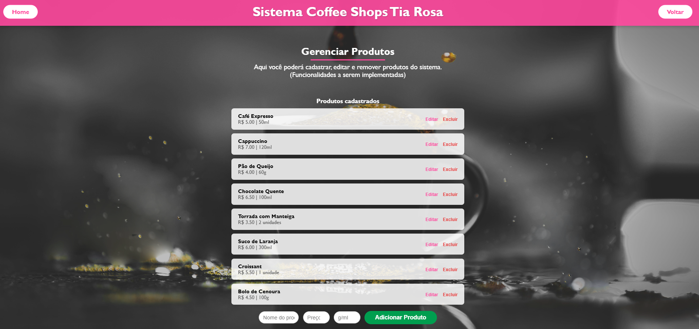
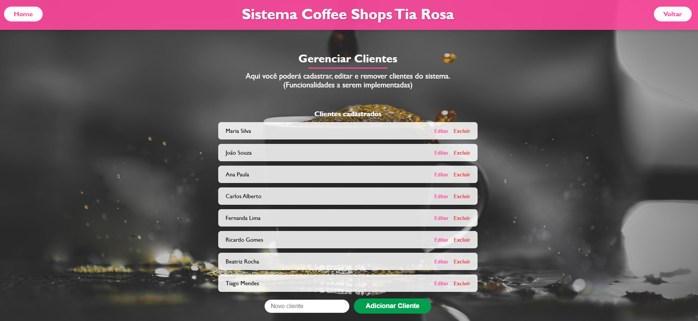
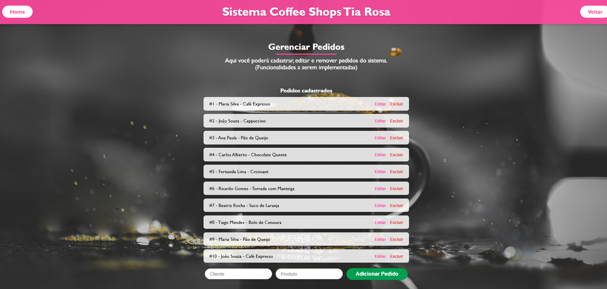
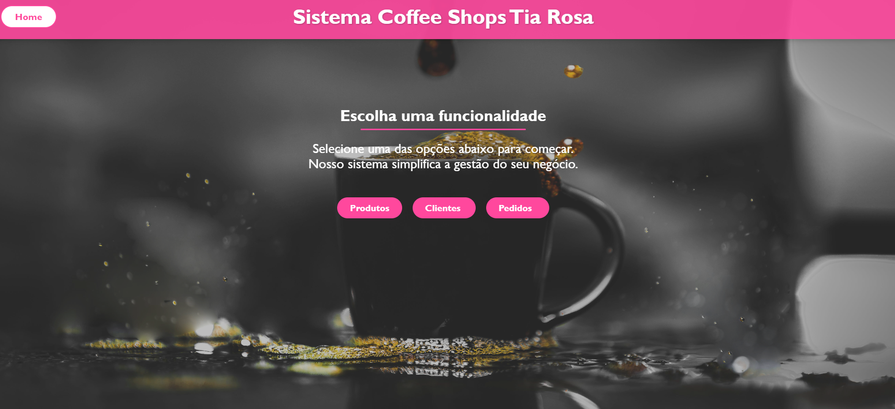
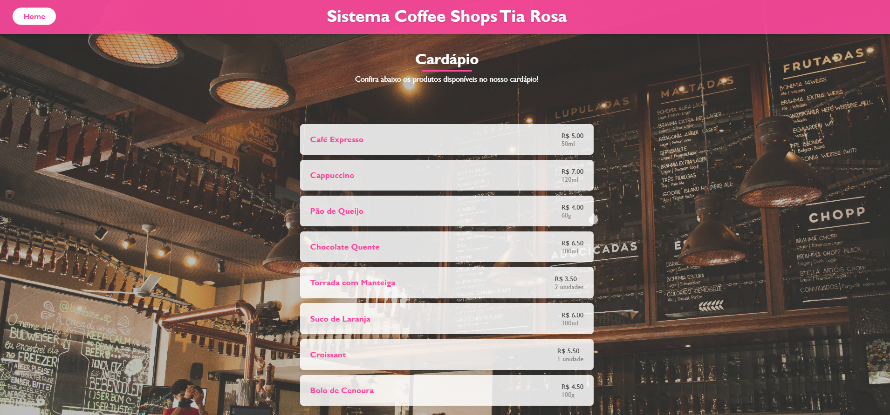

# Coffee Shops Tia Rosa

Sistema de gerenciamento simples feito com Flask para realizar CRUD em memo com FLASK com interface web e python no backend de produtos, clientes e pedidos de uma cafeteria fictícia chamada "Coffee Shops Tia Rosa".

## 🚀 Funcionalidades

* Listagem, adição, edição e exclusão de **produtos** do cardápio.
* Gerenciamento de **clientes**.
* Registro e controle de **pedidos** feitos pelos clientes.
* Interface Web amigável com estilização customizada.

## 🛠️ Tecnologias utilizadas

* **Python 3**
* **Flask** (microframework web)
* **HTML5**, **CSS3**

## 📁 Estrutura básica

```bash
.
├── app.py                  # Arquivo principal com rotas e lógica do servidor
├── templates/              # Templates HTML renderizados pelo Flask
│   ├── index.html
│   ├── sistema.html
│   ├── gerenciar_produtos.html
│   ├── gerenciar_clientes.html
│   └── gerenciar_pedidos.html
├── static/
│   └── images/
│       └── fundo.png       # Imagem de fundo da interface
└── README.md
```

## ▶️ Como executar o projeto localmente

1. Clone este repositório:

```bash
git clone https://github.com/devfelca/Coffe_rosa_iesb.git
```

2. Crie um ambiente virtual (opcional, mas recomendado):

```bash
python -m venv venv
source venv/bin/activate   # Linux/macOS
venv\Scripts\activate      # Windows
```

3. Instale as dependências:

```bash
pip install flask
```

4. Execute a aplicação:

```bash
python app.py
```

5. Acesse no navegador:

```
http://127.0.0.1:5000/
```

## 📌 Observações

* Os dados são armazenados **em memória**, ou seja, serão resetados toda vez que o servidor for reiniciado.
* Ideal para fins educacionais e protótipos rápidos.

## 🧑‍💻 Autor

Desenvolvido por \[Seu Nome].

## 📄 Licença

Este projeto está sob a licença MIT. Sinta-se livre para usar, modificar e distribuir.

## Telas:

### 🏠 Tela Inicial


### 📋 Produtos


### 👥 Clientes


### 📦 Pedidos


### ⚙️ Sistema


### 📑 Cardápio

#
